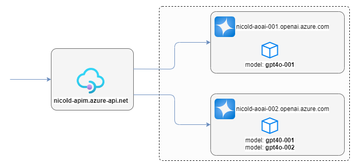
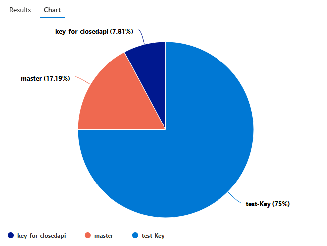
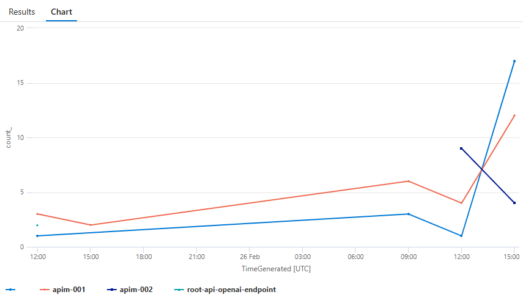
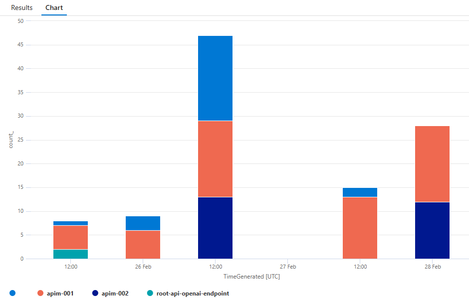

Azure OpenAI (AOAI) Service provides REST API access to OpenAI's powerful language models including o1, o1-mini, GPT-4o, GPT-4o mini, GPT-4 Turbo with Vision, GPT-4, GPT-3.5-Turbo, and Embeddings model series. These models can be easily adapted to your specific task including but not limited to content generation, summarization, image understanding, semantic search, and natural language to code translation.

Azure API Management(APIM), on the other hand, is a comprehensive API management platform that helps enterprises manage, secure, and monitor their APIs. It provides features such as API gateway, rate limiting, analytics, and developer portal, making it easier for businesses to expose their services to internal and external consumers.

By using Azure API Manager in front of Azure Open AI instances, enterprises can ensure better control, security, and visibility over their AI deployments. This setup allows for centralized management of API traffic, improved performance through caching and load balancing, and enhanced security with features like authentication and authorization.

**In this post, I present a collection of API Management recipes that I have gathered while assisting various customers and partners in exposing one or more instances of Azure OpenAI through Azure API Manager.**

> Network configuration and integration with an Enterprise-scale landing zone (ESLZ) is out of scope of this post. For a walkthrough that guides the integration of APIM and AOAI in a hub & spoke context, you can also refer to [my article](https://github.com/nicolgit/hub-and-spoke-playground/blob/main/scenarios/aoai.md) available as part of [the hub-and-spoke playground project](https://github.com/nicolgit/hub-and-spoke-playground).

The lab used for these walk-throughs consists of the following resources:

* 1 x Azure API Management service (developer SKU) `nicold-apim`
* 2 x Azure OpenAI service (S0 SKU) `apimaoai01` and `apimaoai02`



This is the list of topic I will cover:

- [Add Azure Open AI as APIM backend resource](#add-azure-open-ai-as-apim-backend-resource)
- [Expose `apim-001` endpoint as APIM root API](#expose-apim-001-endpoint-as-apim-root-api)
- [Implement throttling](#implement-throttling)
- [Show in a Response header (_aoai-origin_) the host of the OpenAI API Called](#show-in-a-response-header-aoai-origin-the-host-of-the-openai-api-called)
- [Round robin calls between 2 instances of Open AI](#round-robin-calls-between-2-instances-of-open-ai)
- [Fallback on a second openAI instance for 60 secs, if the first answers with 429 error (exceeded token rate limit)](#fallback-on-a-second-openai-instance-for-60-secs-if-the-first-answers-with-429-error-exceeded-token-rate-limit)
- [Generate a report of API Usage by access key](#generate-a-report-of-api-usage-by-access-key)
- [Generate a report of API Usage by source IP](#generate-a-report-of-api-usage-by-source-ip)
- [Generate a report of backends usage over time](#generate-a-report-of-backends-usage-over-time)
- [Generate a report of API requests by OpenAI grouped by deployment-id](#generate-a-report-of-api-requests-by-openai-grouped-by-deployment-id)

# Add Azure Open AI as APIM backend resource

Go to API Management services > `nicold-apim` > Backends > Add
* Name: `apim-001`
* Backend hosting type: Custom URL
* Runtime URL: https://nicold-aoai-001.openai.azure.com/openai
* Authorization credential
    * Headers
        * Name: `api-key`
        * Key: _your endpoint key_
* Click [create]

Go to API Management services > `nicold-apim` > Backends > Add
* Name: `apim-002`
* Backend hosting type: Custom URL
* Runtime URL: https://nicold-aoai-002.openai.azure.com/openai
* Authorization credential
    * Headers
        * Name: `api-key`
        * Key: _your endpoint key_
* Click [create]

Here is the result:


# Expose `apim-001` endpoint as APIM root API

Go to Azure Portal > API Management Services > `nicold-apim` > API > Create from Azure Resources > Azure OpenAI Service
* Azure OpenAI instance: `nicold-aoai-001`
* API Version: `2024-02-01`
* Display name: `/`
* Name: `root-api`
* Click [review and create] and then [create]

This creates a frontend but ALSO a backend. To use the previously created backend, go to:

API Management Services > `nicold-apim` > APIs > All APIs > `/` > Design > Backend > Policies > Base

and change `backend-id="openai-root-openai-endpoint"` to `backend-id="apim-001"`, then save it.

To test this endpoint, go to: API Management Services > `nicold-apim` > APIs > All APIs > `/` > Test > `Creates a completion for the chat message`
* Deployment-id: `gpt4o-001`
* API-version: `2024-02-01` (same as used above)
* Request body: `{"messages": [{ "role": "system","content": "You are a helpful assistant."},{ "role": "user", "content": "Tell me a joke!"} ]}`
* Click: [SEND]

Here is also a PowerShell script to test this configuration:

```ps1
$openai = @{
   api_key     = "my-api-key"
   api_base    = "https://nicold-apim.azure-api.net/" # your endpoint
   api_version = '2024-02-01'
   name        = 'gpt4o-001' # custom name you chose for your deployment
}

$body = '{
  "messages": [
    { "role": "system","content": "You are a helpful assistant."},
    { "role": "user", "content": "Tell me a joke!"}
  ]}'

# Header for authentication
$headers = [ordered]@{
   'api-key' = $openai.api_key
}

# Send a request to generate an answer
$url = "$($openai.api_base)/deployments/$($openai.name)/chat/completions?api-version=$($openai.api_version)"

$response = Invoke-WebRequest -Uri $url -Headers $headers -Body $body -Method Post -ContentType 'application/json'

# Show response headers
$response.headers
$responseObj = ConvertFrom-Json $response.content

# Show response body
$responseObj.choices.message.content
```

# Implement throttling
The following policy limits access to **10 requests per minute**. 
Paste the XML in: API Management Service > `nicold-apim` > APIs > All APIs > `/` > all operations > inbound processing > policies (code editor)

```xml
<policies>
    <inbound>
        <base />
        <rate-limit calls="10" renewal-period="60" />
        <set-backend-service id="apim-generated-policy" backend-id="apim-001" />
    </inbound>
    <backend>
        <base />
    </backend>
    <outbound>
        <base />
    </outbound>
    <on-error>
        <base />
    </on-error>
</policies>
```

To limit to 2 calls **per IP** in 60 seconds, use the following rate-limit XML:
```xml
<rate-limit-by-key calls="2" renewal-period="60" counter-key="@(context.Request.IpAddress)" />
```

To limit to 2 calls per API KEY in 60 seconds, use the following rate-limit XML:
```xml
<rate-limit-by-key calls="2" renewal-period="60" counter-key="@(context.Request.Headers.GetValueOrDefault("api-key"))" />
```

# Show in a Response header (_aoai-origin_) the host of the OpenAI API Called

Paste the XML in: API Management Service > `nicold-apim` > APIs > All APIs > `/` > all operations > inbound processing > policies (code editor), in the **outbound** policy:

```xml
<outbound>
    <base />
    <set-header name="aoai-origin" exists-action="override">
        <value>@(context.Request.Url.Host)</value>
    </set-header>
</outbound>
```

# Round robin calls between 2 instances of Open AI
The following policy implements a round-robin between 2 backends: `apim-001` and `apim-002`.

Paste the XML in: API Management Service > `nicold-apim` > APIs > All APIs > `/` > all operations > inbound processing > policies (code editor)

```xml
<policies>
	<inbound>
		<base />
		<cache-lookup-value key="backend-rr" variable-name="backend-rr" />
		<choose>
			<when condition="@(!context.Variables.ContainsKey("backend-rr"))">
				<set-variable name="backend-rr" value="0" />
				<cache-store-value key="backend-rr" value="0" duration="100" />
			</when>
		</choose>
		<choose>
			<when condition="@(Convert.ToInt32(context.Variables["backend-rr"]) == 0)">
				<set-backend-service backend-id="apim-001" />
				<cache-store-value key="backend-rr" value="1" duration="100" />
			</when>
			<otherwise>
				<set-backend-service backend-id="apim-002" />
				<cache-store-value key="backend-rr" value="0" duration="100" />
			</otherwise>
		</choose>
	</inbound>
	<backend>
		<base />
	</backend>
	<outbound>
		<base />
	</outbound>
	<on-error>
		<base />
	</on-error>
</policies>
```
> 💥 In a round robin scenario, in order to work properly, both OpenAI instances must have the same deployments.

# Fallback on a second openAI instance for 60 secs, if the first answers with 429 error (exceeded token rate limit)

The following policy uses the `apim-001` backend until it responds with `429 ("Requests to ... Operation under Azure OpenAI API version 2024-02-01 have exceeded token rate limit of your current OpenAI S0 pricing tier)`. When this happens, it switches to the `apim-002` endpoint and remains there for `60` seconds.

Paste the following XML in: API Management Service > `nicold-apim` > APIs > All APIs > `/` > all operations > inbound processing > policies (code editor)

```xml
<policies>
    <inbound>
        <base />
        <cache-lookup-value key="useSecondaryBackend" variable-name="useSecondaryBackend" />
        <choose>
            <when condition="@(!context.Variables.ContainsKey("useSecondaryBackend"))">
                <set-backend-service backend-id="apim-001" />
            </when>
            <otherwise>
                <set-backend-service backend-id="apim-002" />
            </otherwise>
        </choose>
    </inbound>
    <backend>
        <base />
    </backend>
    <outbound>
        <base />
        <choose>
            <when condition="@(context.Response.StatusCode == 429 && !context.Variables.ContainsKey("useSecondaryBackend"))">
                <cache-store-value key="useSecondaryBackend" value="true" duration="60" />
            </when>
        </choose>
    </outbound>
    <on-error>
        <base />
    </on-error>
</policies>
```

> 💥 In a fallback scenario, in order to work properly, both OpenAI instances must have the same deployments.

# Generate a report of API Usage by access key

Go to: API Management Services > `nicold-apim` > logs > New Query (KQL mode):

For a table uses:

```kql
ApiManagementGatewayLogs
| where ApimSubscriptionId != ''
| summarize count() by ApimSubscriptionId
| order by count_ desc
| render table
```

For a pie chart:

```kql
ApiManagementGatewayLogs
| where ApimSubscriptionId != ''
| summarize count() by ApimSubscriptionId
| order by count_ desc
| render piechart
```



# Generate a report of API Usage by source IP
Go to: API Management Services > `nicold-apim` > logs > New QUery (KQL mode):

```
ApiManagementGatewayLogs
| where ApimSubscriptionId != ''
| summarize count() by CallerIpAddress
| order by count_ desc
| render table

``` 

# Generate a report of backends usage over time

Go to: API Management Services > `nicold-apim` > logs > New QUery (KQL mode):

Group by hour

```
ApiManagementGatewayLogs 
| where ApimSubscriptionId != '' 
| summarize  count() by bin (TimeGenerated, 1h), BackendId 
| render timechart

```
Group by day
 
```
ApiManagementGatewayLogs 
| where ApimSubscriptionId != '' 
| summarize  count() by bin (TimeGenerated, 1d), BackendId 
| render timechart
```



Column chart

```
ApiManagementGatewayLogs
| where ApimSubscriptionId != ''
| summarize count() by bin(TimeGenerated, 1h), BackendId
| project TimeGenerated, BackendId, count_
| render columnchart  kind=stacked
```

# Generate a report of API requests by OpenAI grouped by deployment-id

Go to: API Management Services > `nicold-apim` > logs > New QUery (KQL mode):

```
ApiManagementGatewayLogs
| extend DeploymentSubstring = extract(@"deployments/([^/]+)", 1, Url)
| where ApimSubscriptionId != ''
| summarize count() by DeploymentSubstring
| render table
```

[def]: #recipes-list