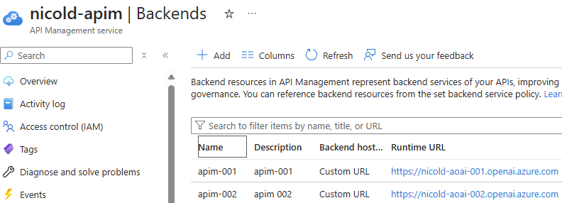

Azure OpenAI Service provides REST API access to OpenAI's powerful language models including o1, o1-mini, GPT-4o, GPT-4o mini, GPT-4 Turbo with Vision, GPT-4, GPT-3.5-Turbo, and Embeddings model series. These models can be easily adapted to your specific task including but not limited to content generation, summarization, image understanding, semantic search, and natural language to code translation.

Azure API Management, on the other hand, is a comprehensive API management platform that helps enterprises manage, secure, and monitor their APIs. It provides features such as API gateway, rate limiting, analytics, and developer portal, making it easier for businesses to expose their services to internal and external consumers.

By using Azure API Manager in front of Azure Open AI instances, enterprises can ensure better control, security, and visibility over their AI deployments. This setup allows for centralized management of API traffic, improved performance through caching and load balancing, and enhanced security with features like authentication and authorization.

Combining Azure Open AI with Azure API Manager enables enterprises to efficiently distribute and manage their AI capabilities while maintaining high standards of security and performance.

----------------------------

obiettivo di questa serie di post é quello di mostrate alcuni dei pattern da usare per esporre Azure Open AI attraverso APIM. 

In this context, the following architecturea and implementation in Azure Architecture Center are **developed** and **maintained** by Azure Pattern and Practices team. I suggest yout to bookmark them for further information.

* https://learn.microsoft.com/en-us/azure/architecture/ai-ml/architecture/azure-openai-baseline-landing-zone
* https://github.com/Azure-Samples/azure-openai-chat-baseline-landing-zone

in questi post ci focalizzeremo sulla configurazione delle policy e di implementazione di alcuni pattern di utilizzo con esse. La parte di configurazione della rete e l'integrazione con una ESLZ é out of scope. Per un walktrough che guidi l'integrazione di APIM ed AOAI in un contesto di hub & spoke, è possibile fare riferimento anche [al mio articolo](https://github.com/nicolgit/hub-and-spoke-playground/blob/main/scenarios/aoai.md) disponibile nell'ambito del progetto [the hub-and-spoke playground](https://github.com/nicolgit/hub-and-spoke-playground)


Il laboratorio su cui lavoró prevede le seguenti risorse:

* Azure API Management service (developer SKU) enterpriseapim
* 2 x Azure OpenAI service (S0 SKU) `apimaoai01` and `apimaoai02`

come mostrato nello schema seguente:


# Add Azure Open AI as backend resource

Go to API Management services > `nicold-apim` > Backends > Add
* Name: `apim-001`
* Backend hosting type: Custom URL
* Runtime URL: https://nicold-aoai-001.openai.azure.com/openai
* Authorization credential
  * Headers
    * Name: `api-key`
    * Key: _your endpoint key_
* click [create]

Go to API Management services > `nicold-apim` > Backends > Add
* Name: `apim-002`
* Backend hosting type: Custom URL
* Runtime URL: https://nicold-aoai-002.openai.azure.com/openai
* Authorization credential
  * Headers
    * Name: `api-key`
    * Key: _your endpoint key_
* click [create]

Here the result:


# Show apim-001 endpoint as root API

Go to Azure Portal > API Management Sevices > `nicold-apim` > API > Create form Azure Resources > Azure OpenAI Service
* Azure OpenAI instance: `nicold-aoai-001`
* API Version: `2024-02-01`
* Display name: `/`
* name: `root-api`
* click [review and create] and then [create]

This creates a frontend but ALSO a backend. To use the previously created backend go to: 

API Management Services > `nicold-apim` > APIs > All APIs > `/` > Design > Backend > Policies > Base

and change `backend-id="openai-root-openai-endpoint"` to `backend-id="apim-001"`, then save it.

To test this endpoint go to: API Management Services > `nicold-apim` > APIs > All APIs > `/` > Test > `Creates a completion for the chat message` 
* deployment-id: `gpt4o-001`
* api-version: `2024-02-01` (same used above)
* request body: `{"messages": [{ "role": "system","content": "You are a helpful assistant."},{ "role": "user", "content": "Tell me a joke!"} ]}`
* click: [SEND]

here also a powershell script to test this configuration:

```
$openai = @{
   api_key     = "my-api-key"
   api_base    = "https://nicold-apim.azure-api.net/" # your endpoint
   api_version = '2024-02-01'
   name        = 'gpt4o-001' # custom name you chose for your deployment
}

$body = '{
  "messages": [
    { "role": "system","content": "You are a helpful assistant."},
    { "role": "user", "content": "Tell me a joke!"}
  ]}'

# Header for authentication
$headers = [ordered]@{
   'api-key' = $openai.api_key
}

# Send a request to generate an answer
$url = "$($openai.api_base)/deployments/$($openai.name)/chat/completions?api-version=$($openai.api_version)"

$response = Invoke-WebRequest -Uri $url -Headers $headers -Body $body -Method Post -ContentType 'application/json'

# Show response headers
$response.headers
$responseObj = ConvertFrom-Json $response.content

# Show response body
$responseObj.choices.message.content
```

# Implement throttling
The following policy limits the access **at 10 requests per minute**. Paste the xml in: API Management Service > 
`nicold-apim` > APIs > All APIs > `/` > all operations > inbound processing > policies (code editor)

```
<policies>
    <inbound>
        <base />
        <rate-limit calls="10" renewal-period="60" />
        <set-backend-service id="apim-generated-policy" backend-id="apim-001" />
    </inbound>
    <backend>
        <base />
    </backend>
    <outbound>
        <base />
    </outbound>
    <on-error>
        <base />
    </on-error>
</policies>

```

To limit at 2 calls **per IP** in 60 seconds, use the following rate-limit xml:
```
<rate-limit-by-key calls="2" renewal-period="60" counter-key="@(context.Request.IpAddress)" />
```

To limit at 2 calls per API KEY in 60 seconds, use the following rate-limit xml:
```
<rate-limit-by-key calls="2" renewal-period="60" counter-key="@(context.Request.Headers.GetValueOrDefault("api-key"))" />
```

# Show in a Response header (_aoai-origin_) the host of the OpenAI API Called

Add the following XML in the **outbound** policy: 

```
<outbound>
    <base />
    <set-header name="aoai-origin" exists-action="override">
        <value>@(context.Request.Url.Host)</value>
    </set-header>
</outbound>
```

# Round robin calls between 2 instances of Open AI

Use the following **inbound** policy:

```
<inbound>
    <base />
    <cache-lookup-value key="backend-rr" variable-name="backend-rr" />
    <choose>
        <when condition="@(!context.Variables.ContainsKey("backend-rr"))">
            <set-variable name="backend-rr" value="0" />
            <cache-store-value key="backend-rr" value="0" duration="100" />
        </when>
    </choose>
    <choose>
        <when condition="@(Convert.ToInt32(context.Variables["backend-rr"]) == 0)">
            <set-backend-service backend-id="apim-001" />
            <set-variable name="backend-rr" value="1" />
            <cache-store-value key="backend-rr" value="1" duration="100" />
        </when>
        <otherwise>
            <set-backend-service backend-id="apim-002" />
            <set-variable name="backend-rr" value="0" />
            <cache-store-value key="backend-rr" value="0" duration="100" />
        </otherwise>
    </choose>
</inbound>
```
> 💥In a round robin scenario, both open AI instances must have same deployments

# Fallback on a second openAI instance for 30 secs. If the first send a 4xx error

TODEBUG!!!


<policies>
    <inbound>
        <base />
        <cache-lookup-value key="useSecondaryBackend" variable-name="useSecondaryBackend" />
        <choose>
            <when condition="@(context.Variables["useSecondaryBackend"] != null)">
                <set-backend-service backend-id="apim-002" />
            </when>
            <otherwise>
                <set-backend-service backend-id="apim-001" />
            </otherwise>
        </choose>
    </inbound>
    <backend>
        <base />
    </backend>
    <outbound>
        <base />
    </outbound>
    <on-error>
        <base />
        <set-header name="aoai-origin" exists-action="override">
            <value>@(context.Request.Url.Host)</value>
        </set-header>
        <choose>
            <when condition="@(context.Response.StatusCode >= 400 && context.Response.StatusCode < 500)">
				<set-variable name="useSecondaryBackend" value="true" />
                <cache-store-value key="useSecondaryBackend" value="true" duration="60" />
            </when>
        </choose>
    </on-error>
</policies>


--------------------------

* Azure APIM to scale AOAI - https://github.com/Azure/aoai-apim 
* Manage Azure OpenAI using APIM - https://github.com/microsoft/AzureOpenAI-with-APIM
