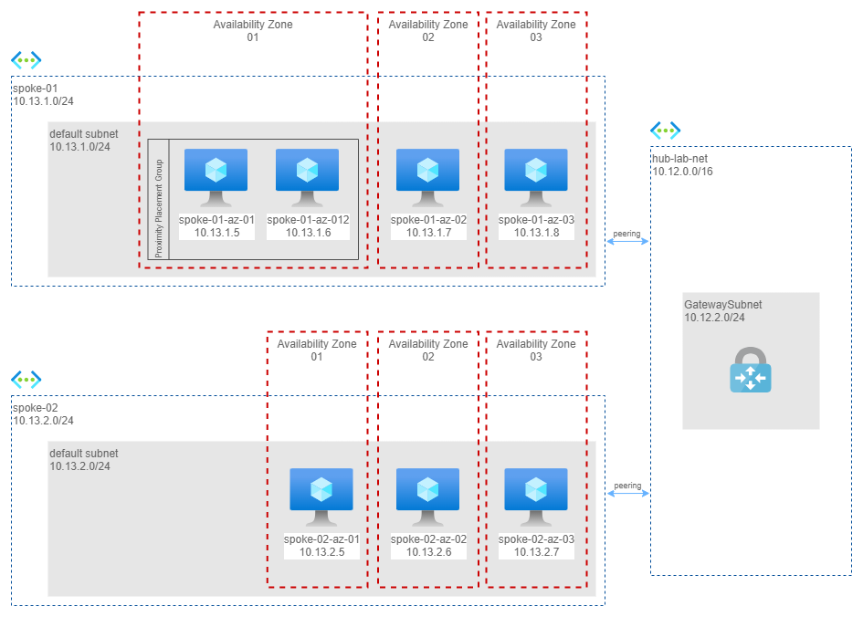
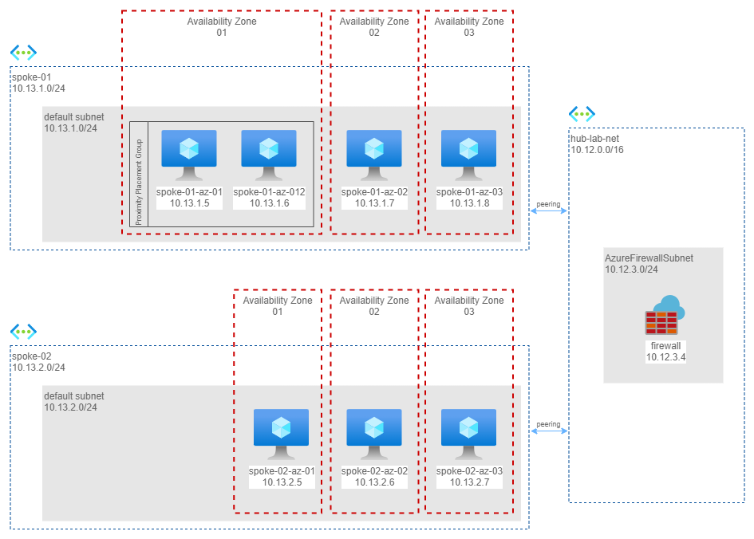

[Latency](https://www.techtarget.com/whatis/definition/latency) is an expression of how much time it takes for a data packet to travel from one designated point to another. Ideally, latency will be as close to zero as possible. High network latency can **dramatically increase webpage load times**, interrupt video and audio streams, and render an application unusable. Depending on the application, even a relatively small increase in latency can ruin UX.

[Azure availability zones](https://docs.microsoft.com/en-us/azure/availability-zones/az-overview) are physically separate locations within each Azure region that are tolerant to local failures. **Azure availability zones are connected by a high-performance network with a round-trip latency of less than 2ms**. 

in Azure, each data center is assigned to a physical (availability) zone. Physical zones are mapped to logical (availability) zones in your Azure subscription. You can design resilient solutions by using Azure services that use availability zones. Co-locate your compute, storage, networking, and data resources across an availability zone, and replicate this arrangement in other availability zones.

A [proximity placement group](https://azure.microsoft.com/en-us/blog/announcing-the-general-availability-of-proximity-placement-groups/) is an Azure Virtual Machine logical grouping capability that you can use to decrease the inter-VM network latency associated with your applications. When the VMs are deployed within the same proximity placement group, they are physically located as close as possible to each other.

Understanding the latency implications of different network configurations is essential when designing a high-availability and resilient architecture. It is crucial to consider the impact of latency on application performance and user experience. By measuring latency between virtual machines in various network setups, you can assess the effectiveness of different configurations. This knowledge can help you make informed decisions when building your architecture.

In this blog post I measure the latency between virtual machines deployed in Azure's **West Europe region** in the following configurations:

* same v-net, same availability zone, same proximty placement group
* same v-net, across availability zones
* multiple v-nets (in peering), same availability zone
* multiple v-nets (in peering), across availability zones
* multiple v-nets connected in a Hub & Spoke topology and Routing via [Azure Virtual Network Gateway](https://docs.microsoft.com/en-us/azure/vpn-gateway/vpn-gateway-about-vpngateways)
* multiple v-nets connected in a Hub & Spoke topology and Routing via [Azure Firewall](https://docs.microsoft.com/en-us/azure/firewall/overview)

Rather than the absolute values, my focus is on assessing the impact in terms of latency of various network configurations.

To measure latency, I used [Latte](https://github.com/microsoft/latte), a Windows network latency benchmark tool available on GitHub. You can find more information on how to measure network latency between Azure VMs using Latte (on Windows) and SOCKPERF (on Linux) at [this link](https://learn.microsoft.com/en-us/azure/virtual-network/virtual-network-test-latency?tabs=windows ).

> The [**Azure hub and spoke playground**](https://github.com/nicolgit/hub-and-spoke-playground) is a GitHub repository where you can find a reference network architecture that I use as a common base to implement configurations and test networking and connectivity scenarios. I have also used it here as a starting point to build the lab used in this post.

# Scenario 1 - one virtual network

In this scenario I have a calling machine in one availability zone and 3 additional machines each in a different availability zone. In availability zone 1 I have also placed both machines in the same proximity placement group to have the best possible latency, as shown below.

Here the measures from `spoke01-az-01` (Availability Zone 1).

| commamd | Availability Zone |  Latency (usec) |  
|---------|-------------------|-----------------|
`latte -c -a 10.13.1.6:80 -i 60000` | 1  | **65.15**    |
`latte -c -a 10.13.1.7:80 -i 60000` | 2  | **119.87**   |
`latte -c -a 10.13.1.8:80 -i 60000` | 3  | **1199.54**  |

Takeaways:

* The Proximity Placement Group performs exceptionally well, with latency well below 2ms (only 65 microseconds!)
* When communicating between availability zones, I consistently measured an average latency below 2ms.
* The significant difference in latency between communication from AZ1 to AZ2 and AZ1 to AZ3 is likely due to the non-uniform distance between the three Availability Zones in the West Europe region. These three zones are positioned in a highly pronounced isosceles triangle around Amsterdam.

# Scenario 2 - two virtual networks in peering

In this scenario I have measured the impact of a network peering. I have created 3 more machines, in 3 availability zones, on another network, in peering.

Here the measures from `spoke01-az-01` (availability zone 1) to machines in another virtual network in peering.

| commamd | Availability Zone |  Latency (usec) |  
|---------|-------------------|-----------------|
`latte -c -a 10.13.2.5:80 -i 60000` | 1  | **57.92**   |
`latte -c -a 10.13.2.6:80 -i 60000` | 2  | **112.22**  |
`latte -c -a 10.13.2.7:80 -i 60000` | 3  | **1062.29** |

Takeaways:
* Network peering does not add any measurable overhead.
* The latency between two VMs in AZ1, even if they are not in the same proximity group, is almost equal to or even better than the latency between two VMs in the same proximity group. It is possible that `spoke-02-az-01` has been provisioned very close to `spoke-01-az-01`, although it is not guaranteed.

# Scenario 3 - two virtual networks in H&S configuration with a Virtual Network Gateway in between

In this scenario I moved to a more classic configuration: I eliminated peering and routed traffic through a central hub and an Azure Virtual Network Gateway.

Here the measures from `spoke01-az-01` (availability zone 1) to machines in another virtual network via an Azure Virtual Network Gateway in the Hub Network.

| commamd | Availability Zone |  Latency (usec) |  
|---------|-------------------|-----------------|
`latte -c -a 10.13.2.5:80 -i 60000` | 1  | 887.56  |
`latte -c -a 10.13.2.6:80 -i 60000` | 2  | 957.46  |
`latte -c -a 10.13.2.7:80 -i 60000` | 3  | 2124.09 |

Takeaways

* Latency increased up to **0.8/2.1ms** because each packet has to cross 2 peerings and a virtual appliance (Azure Virtual Network Gateway).
* Staying in the same availability zone still has a positive impact on latency. Communication between AZ1 and AZ2 increases latency by a small amount (0.1ms), but in the case of AZ3, latency reaches just over 2ms. However, we are still within the limits stated by Microsoft, as the guaranteed 2ms latency does not account for the presence of a virtual appliance in between.

# Scenario 4 - two virtual networks in H&S configuration with an Azure Firewall in between

In this last scenario I implemented the [reference architecture described in the cloud adoption framework](https://docs.microsoft.com/en-us/azure/architecture/reference-architectures/hybrid-networking/hub-spoke), that is a hub and spoke, with an Azure Firewall to control all the traffic. 

Here the measures from `spoke01-az-01` (availability zone 1) to machines in another virtual network and different availability zones, via Azure Firewall in the Hub Network.

| commamd | Availability Zone |  Latency (usec) |  
|---------|-------------------|-----------------|
`latte -c -a 10.13.2.5:80 -i 60000` | 1  | 2418.44 |
`latte -c -a 10.13.2.6:80 -i 60000` | 2  | 2605.39  |
`latte -c -a 10.13.2.7:80 -i 60000` | 3  | 1575.93  |

Takeaways

* The latency with the Azure Firewall is comparable to that of the Azure Virtual Network Gateway in between.
* There are still situations where the latency is below 2ms or slightly higher (2.4/2.6ms).
* The transit time through the firewall can also vary depending on the capabilities enabled on the server and the number or policy rules that the traffic crosses.

# Final thoughts

* Whenever possible, **always use Proximity Placement Groups** to achieve lower latency.
* Traffic between zones has been consistently measured to be **below 2ms**.
* Peerings have minimal impact on latency.
* The hub-and-spoke architecture can have an impact on latency, but by using either a VPN Gateway or, preferably, an Azure Firewall as a virtual appliance, the latency remains almost within the 2ms threshold.

More information
* Test Network Latency on Azure VM: https://learn.microsoft.com/en-us/azure/virtual-network/virtual-network-test-latency?tabs=windows 
