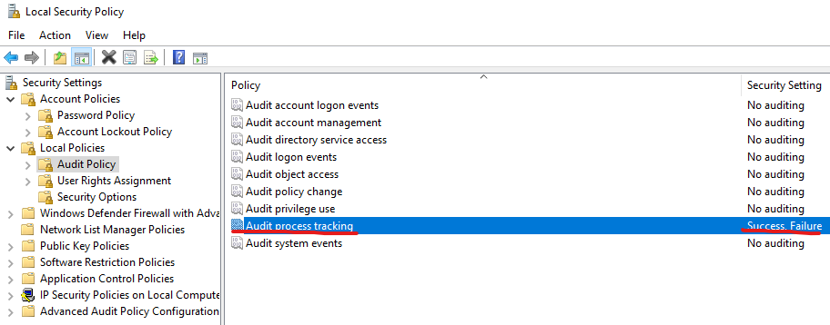

In this blog post, I show how to intercept the use by a user of the command "**run-as-administrator**" on the Windows operating system.  
   
The event to monitor is [4688(S): A new process has been created](https://learn.microsoft.com/en-us/previous-versions/windows/it-pro/windows-10/security/threat-protection/auditing/event-4688)  
   
This event generates every time a new process starts. To recognize the "run-as-administrator" use, it is necessary to check the value of the `Token Elevation Type` field, in particular, it must contain `%%1937`

This event is disabled by default, but it can be enabled via GPO https://learn.microsoft.com/en-us/windows-server/identity/ad-ds/manage/component-updates/command-line-process-auditing for domain machines or using the local security policy for stand alone servers (`Local Security Policy` > `Local Policy` > `Audit Policy` > `Audit Process Tracking`)
 


The XPATH query, which can be used as a filter in the event to recognize this event, is as follows

```xml
<QueryList>
  <Query Id="0" Path="Security">
    <Select Path="Security">*[System[(EventID=4688)]]
      [EventData
    [Data
        [@Name='TokenElevationType'] and
        (Data='%%1937')
    ]]</Select>
  </Query>
</QueryList>
```

The same query can also be used in a Data Collection Rule in Azure:

* Data Source: Windows Event log
* Query Type: Custom
* Xpath Query: `[EventData[Data[@Name='TokenElevationType']and(Data='%%1937')]]`
  
As indicated in the official documentation below:

> %%1937: Type 2 is an elevated token with no privileges removed or groups disabled. An elevated token is used when User Account Control is enabled and the user chooses to start the program using Run as administrator. An elevated token is also used when an application is configured to always require administrative privilege or to always require maximum privilege, and the user is a member of the Administrators group.

this event is also triggered when an application is configured to always require administrative privilege or to always require maximum privilege, and the user is a member of the Administrators group, so **the presence of false positives is possible.**