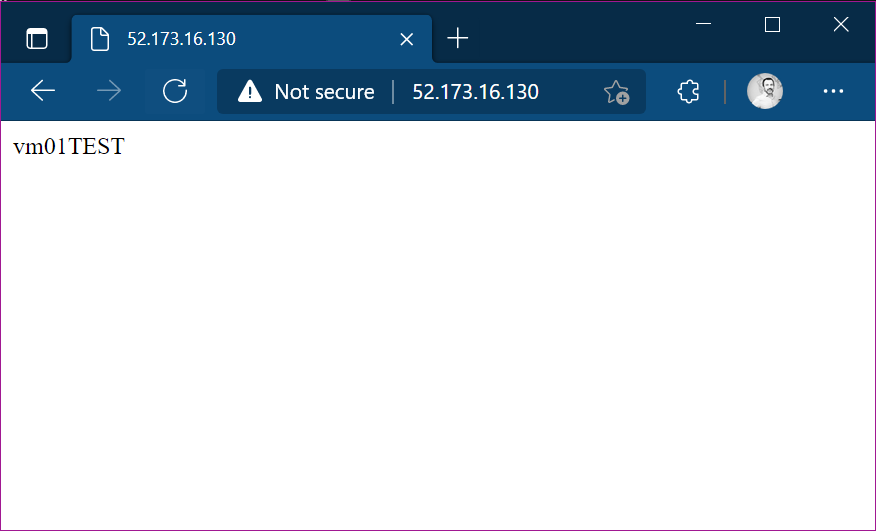

For my **Labs**, I often need to create and build virtual machines. **Many virtual machines** :-). One of the most "popular" machine recently is for me the web server. The requirement for my needs is often very simple: **create a web server that responds on port 80, that is able to make me understand "what machine I’m interacting with"**, so, the ideal response message to the request *http://my-machine-ip* should be "*myMachineName*".


# Windows machine

From Azure portal is quick enough to create a virtual machines. In particular I use as the starting image "**windows 2019 datacenter gen1**".

Once the machine is created, go tpo Azure Portal > virtual machines > `vmname` > run command > run powershell script

type:

```powershell
Install-WindowsFeature -name Web-Server -IncludeManagementTools
Remove-Item -Path 'C:\inetpub\wwwroot\iisstart.htm'
Add-Content -Path 'C:\inetpub\wwwroot\iisstart.htm' -Value $($env:computername)
```

click **Run**

After a couple of minutes the script will be executed, and IIS will be provisioned and working.



# Linux machine
From Azure portal is quick enough to create a virtual machines. In particular I use as the starting image "**windows 2019 datacenter gen1**".

Once the machine is created, go tpo Azure Portal > virtual machines > `vmname` > run command > run linux shell script

type:

```shell
sudo apt-get update
sudo apt-get install -y nginx
sudo rm /var/www/html/index.html
echo $HOSTNAME | sudo tee /var/www/html/index.html
```

click **Run**

After a couple of minutes the script will be executed, and IIS will be provisioned and working.


