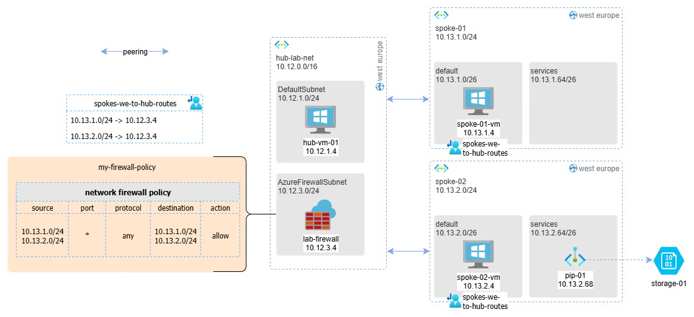
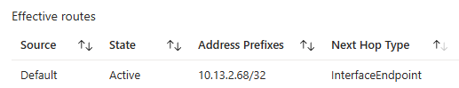
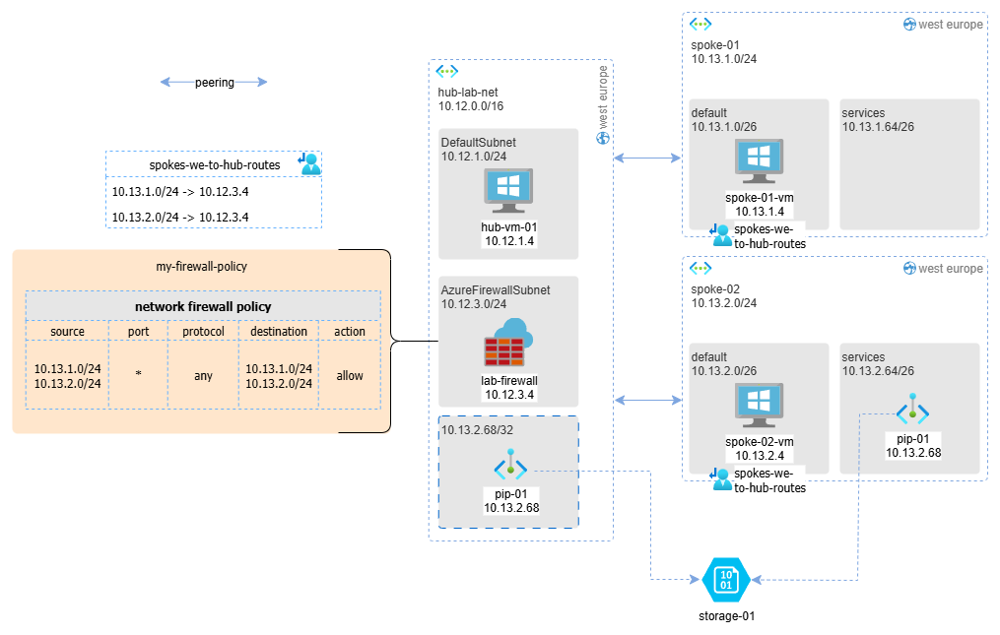
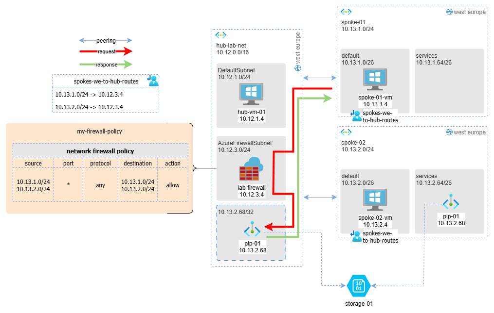
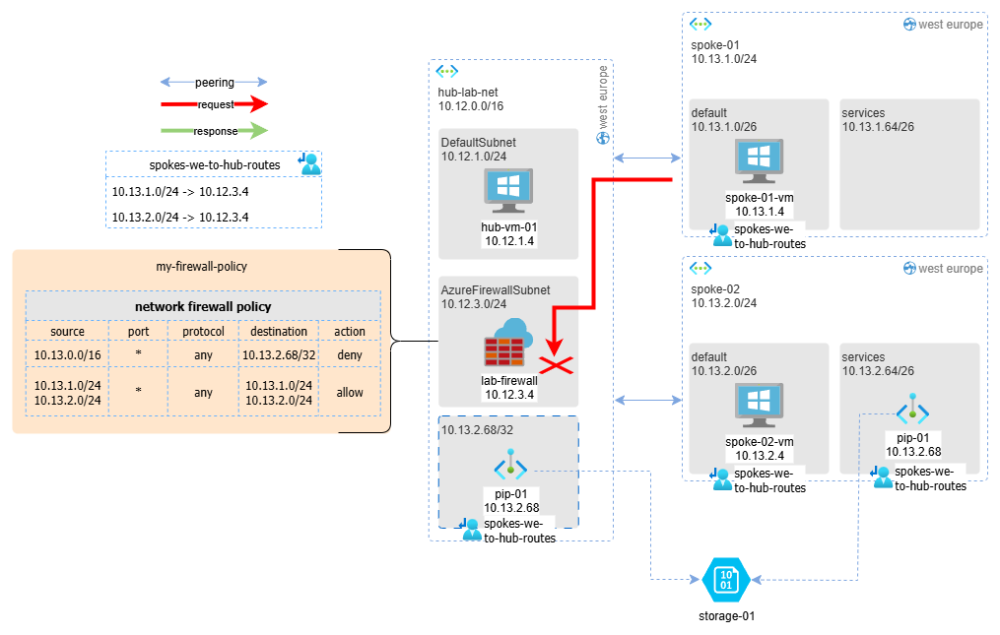

Recently, I helped a customer understand a puzzling behavior related to a private endpoint deployed in a classic Azure hub-and-spoke network topology.

## TL;DR

The reason for the apparently anomalous behavior of private endpoints is that, although a private endpoint appears in the Azure portal as a network interface (NIC) connected to a subnet, **it's actually implemented completely differently under the hood**.

When Azure creates a private endpoint and attaches it to a subnet, what actually happens is that Azure creates explicit routes on all NICs connected to the VNet where the private endpoint is activated.

**These same routes are also added to the NICs of all virtual machines connected to networks that are peered with the one where the private endpoint is exposed.**

Let me walk you through the details.

## The Network Scenario

The situation is shown in the following diagram: there are 2 spoke VNets connected to a hub VNet. The hub contains an Azure Firewall configured to allow any-to-any traffic. The requirement was to avoid exposing the private endpoint externally to spoke networks, and the idea was to not attach any route table to the private endpoint subnet.

In this configuration, we would expect the following connectivity to the storage account:

## Expected vs. Actual Behavior

**Expected connectivity:**
* spoke-01-vm HTTPS to storage-01: ❌ FAIL (missing return route)
* spoke-02-vm HTTPS to storage-01: ✅ OK (same subnet)
* hub-vm-01 HTTPS to storage-01: ✅ OK (direct peering exists)

**Actual connectivity:**
* spoke-01-vm HTTPS to storage-01: ✅ OK
* spoke-02-vm HTTPS to storage-01: ✅ OK  
* hub-vm-01 HTTPS to storage-01: ✅ OK

WHY ?!?!? :-)

## Understanding the Root Cause

When examining the effective routes of `hub-vm-01`, we find the following route:

The same route is present on the NICs of the firewall VMs as well. This means it's **as if storage-01 is connected to both spoke-02 and the hub network**.

### How the Traffic Actually Flows

When `spoke-01-vm` tries to contact the storage account:

1. **Outbound traffic**: Thanks to the route table on its subnet, traffic reaches the firewall and then goes directly to the private endpoint (pip-01), without passing through the peering to spoke-02
2. **Return traffic**: Since the private endpoint behaves "as if" it's also connected to the hub, the response from pip-01 can reach spoke-01-vm without needing the routing table and without passing through the firewall, because it only traverses one peering instead of two.

## The Solution: Centralized Firewall Control

One effective way to solve this is:

1. **Add a route table to the private endpoint subnet** that redirects traffic to the firewall
2. **Manage access control at the firewall level** to block or allow access to that subnet

> ⚠️Warning⚠️: when a route table is associated with a subnet, by default it is not applied to private endpoints as well, so it's necessary to remember to enable the option Network Policy for Private Endpoints > Private endpoint network policy > `route tables` on the subnet.

### Why This Approach Works

Centralizing control at the firewall level is an approach I've seen applied in numerous contexts, and from a management perspective, it's generally a good compromise because:

- **Centralized security policies**: All traffic rules are managed in one place
- **Consistent logging and monitoring**: All traffic flows through a single inspection point
- **Simplified troubleshooting**: Network issues can be diagnosed from a central location
- **Scalability**: New spokes can be added without complex routing configurations

## Key Takeaways

1. **Private endpoints create implicit routes** across all peered VNets, not just the VNet where they're deployed
2. **Portal representation is misleading**: While they appear as NICs in a subnet, their routing behavior is different
3. **Route tables alone aren't sufficient** for controlling private endpoint access in hub-and-spoke topologies
4. **Firewall-centric control** provides better security and management capabilities

## Related Resources

For more detailed information on this specific topic, check out

- 🔝 [Private endpoints are an illusion](https://blog.cloudtrooper.net/2025/01/20/private-link-reality-bites-private-endpoints-are-an-illusion/)
- [Azure Private Link documentation](https://learn.microsoft.com/en-us/azure/private-link/)
- [Hub-spoke network topology in Azure](https://learn.microsoft.com/en-us/azure/architecture/reference-architectures/hybrid-networking/hub-spoke)
- [Azure Firewall in a hub-spoke network](https://learn.microsoft.com/en-us/azure/firewall/firewall-faq)