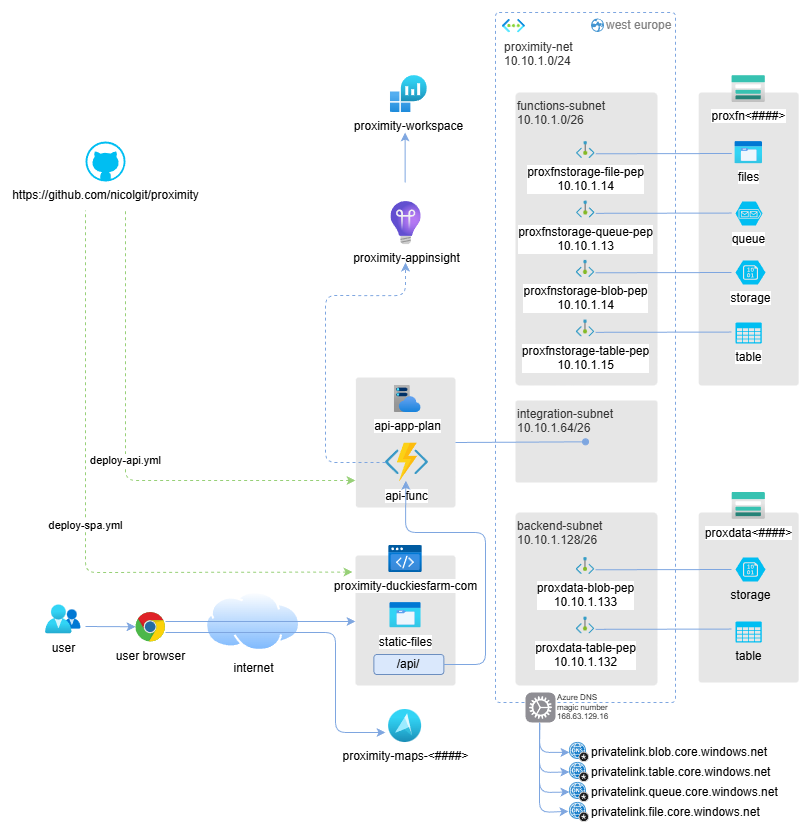
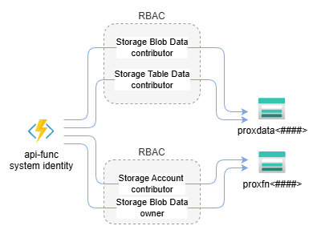

> **tl;dr** If you're interested in the project itself and do not want to waste your time reading this post 😅, here is the [GitHub repo](https://github.com/nicolgit/proximity) and here is the [Proximity project](https://proximity.duckiesfarm.com/) live.

For me, open source is not a side activity, it's a deliberate part of how I practice coding and architecture. 

In the enterprise environments I usually work in as a Chief Cloud & AI Architect, architecture is often constrained by existing platforms, organizational inertia, legacy decisions, political trade-offs.

> Those constraints are real — but they also limit experimentation.

An open source side project gives me a different space, a place with no hidden assumptions, no artificial deadlines, no "we'll fix it later in production" — every decision can stand on its own.

**The Proximity project** started exactly this way: inspired by [a post I found on reddit](https://www.reddit.com/r/roma/comments/1ib2ue7/mappa_di_roma_dentro_il_raccordo_indicando_in/), it is an open source tool that visualizes walking-distance isochrones from public transport stops (trains, metro, trolleys, buses) across multiple metropolitan areas and a **controlled environment** that allows me to apply patterns and learn to use frameworks that would otherwise remain somewhat sterile without a clear purpose.

The objective of this post is to show why I treat Proximity as more than a toy project: it is a sandbox for practicing real cloud architecture, experimenting with new frameworks, and stress-testing patterns like serverless, IaC, and AI-assisted development in a space where I can make deliberate, opinionated decisions end to end.

# The project

When talking about public transport accessibility, we often rely on simplified assumptions.

* Stops are either “served” or “not served”.
* Areas are either “covered” or “uncovered”.

In practice, accessibility is rarely binary.

What really affects usability is not the presence of a stop, but how far people can realistically walk to reach it. Five minutes on a flat sidewalk is very different from five minutes uphill.

Two stops 300 meters apart can serve very different areas.

> Straight-line distance doesn’t represent how people move.

What matters is the REAL walking time: Isochrones model this more accurately by showing where you can actually get to within a given walking time.

**The Proximity project** uses walking-distance isochrones to make this visible. This problem looks simple on the surface, but it quickly becomes non-trivial when you scale it:

* many cities
* many stops
* many transport types
* multiple distance thresholds
* interactive visualization on desktop and mobile browsers

It forces you to think about data modeling, computation cost, caching, and the frameworks to use.

When I started building, the goal seemed simple: compute walking-distance isochrones for multiple transport stops and display them interactively.

**As the project grew, scaling it across cities, transport types, and interactive maps forced deliberate architectural choices.**

## The Frontend
SPA with Vue and TypeScript:
* TypeScript helps catch errors at compile-time, making the codebase more robust and maintainable than plain JavaScript.
* Vue provides a reactive, component-based framework that is lightweight, easy to reason about, and ideal for building interactive map interfaces.

Maps with Leaflet:
* Leaflet is fast, flexible, and lightweight. It integrates well with tile-based rendering and supports vector overlays and pin points, which I use to show isochrones.

Deployment to a Azure Static Web Apps:
* Benefits: fast global distribution, low cost, automatic HTTPS, and seamless integration with GitHub CI/CD.
* The SPA model pairs perfectly with static hosting, as most logic runs client-side while fetching precomputed data.

## The Backend
Azure Functions in C#:
* C# provides strong typing and mature tooling, which helps maintain reliability in serverless code.
* Serverless functions are cheap, scale automatically, and fit perfectly for event-driven tasks like serving requests for metadata or trigger-based operations.

## Data storage and caching
On the data side:
* Areas metadata are stored in Azure Table Storage
* Isochrone JSON blobs are stored in Azure Blob Storage with CDN-friendly headers
  
Benefits: fast, cheap, globally distributed, and easy to update. Most of the data is relatively static, so caching reduces latency and costs.

## Isochrone computation
Real-time computation of walking-distance isochrones **is too expensive**: iterating over the pedestrian network for thousands of stops and stations would be slow. So I opted for offline precomputation using a CLI generator written in C#.

In this setup:
* Mapbox APIs handle the heavy lifting of isochrone calculation
* OpenStreetMap data is retrieved through the Overpass API to collect the stops to analyze
* All results are stored in Blob Storage, ready to be served by the SPA

This approach balances accuracy, performance, and cost without compromising interactivity.

# Deploy on Azure
Proximity isn’t just about computing isochrones and displaying them.
Running it reliably and securely in the cloud requires careful architectural choices.

_Architecture deployed on Azure_

_Azure function system identity RBAC_

## Infrastructure as Code (IaC)
All resources are deployed using Infrastructure-as-Code written in **Bicep**. Benefits:
* Reproducibility: environments can be recreated consistently
* Traceability: every change is tracked in source control
* Ease of iteration: no manual clicks, everything is declarative

## Azure network isolation
* All backend services run behind a private endpoint in an isolated Azure virtual network.
* Frontend accesses backend securely through this private link.
* System-assigned identities are used for authentication between services, eliminating the need for secrets in code.

Advantages:
* Strong security posture by default
* Minimizes attack surface
* Simplifies credential management and compliance

## CI/CD with GitHub Actions
Both frontend and backend are deployed automatically via 2 GitHub Actions:
1. Builds and deploys SPA to Azure Static Web Apps
2. Builds and deploys Azure Functions

Benefits:

* Fully automated workflow
* Fast and repeatable deployments
* Low operational overhead

# Key trade-offs and deliberate architectural choices

* Avoided fully dynamic computation → would be too slow and costly
* Chose serverless → cheap, scalable, low ops overhead
* Avoided monolithic backend → caching and offline computation are simpler with a clean separation
* Opted for TypeScript + Vue → maintainable frontend without unnecessary complexity
* Leaflet → lightweight and flexible for map visualization

Each choice reflects a trade-off between simplicity, performance, and maintainability.

Building Proximity was a technically simple idea on paper, but the process taught me many lessons — both about architecture and about using AI-assisted development.

## Highlights
* VS Code + Copilot accelerated development **enormously**.
* Writing C# code I already knew well, I went from hours to minutes on many tasks.
* For Vue and Leaflet, which were completely new to me, Copilot helped me scaffold components and learn the development paradigm quickly.
* Rapid prototyping and iteration became possible: I could test frontend-backend interactions without blocking myself on unfamiliar frameworks.
* Hands-on experience with new libraries: I now have a solid foundation in Vue and Leaflet, which will inform future projects.

## Lowlights
* At first, I let AI drive too much of the frontend implementation because I wanted to see what it would produce.
  * **Result**: some code is verbose, repetitive, or not as clean as I would have written manually.
  * **Lesson**: when using AI for new technologies, prepare focused, precise prompts for better results.
* Refactoring is still needed: even with AI, improving structure or fixing repeated patterns takes time.
  * Proper upfront design reduces refactoring and ensures maintainable code.

# Key takeaways

* AI can accelerate coding and learning, but it does not replace careful planning.
* Spend time upfront defining prompts, patterns, and architecture, especially with unfamiliar technologies.
* Iterating on real projects is the fastest way to learn frameworks and libraries.
* Trade-offs are unavoidable: balance speed, maintainability, and clarity.
* **The Proximity Project** became not just a tool, but a learning experience, combining architectural thinking, cloud deployment, and AI-assisted development.

# Want to go deeper?

If you made it this far, **thank you for reading** 😅.

If you'd like to explore more:

* **Try the live tool: [Proximity project](https://proximity.duckiesfarm.com/)**
* **Browse the source code: [GitHub repo](https://github.com/nicolgit/proximity)**

If you have ideas, suggestions, or spot something that could be improved, **please open an issue on GitHub** — that's the best place to discuss features, fixes, and architectural decisions.

